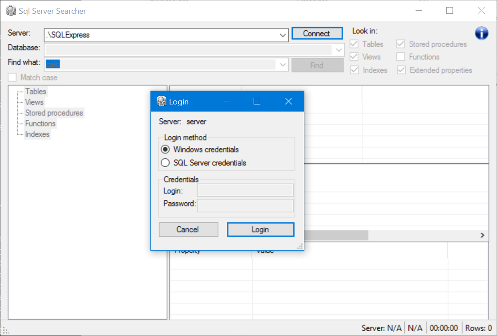
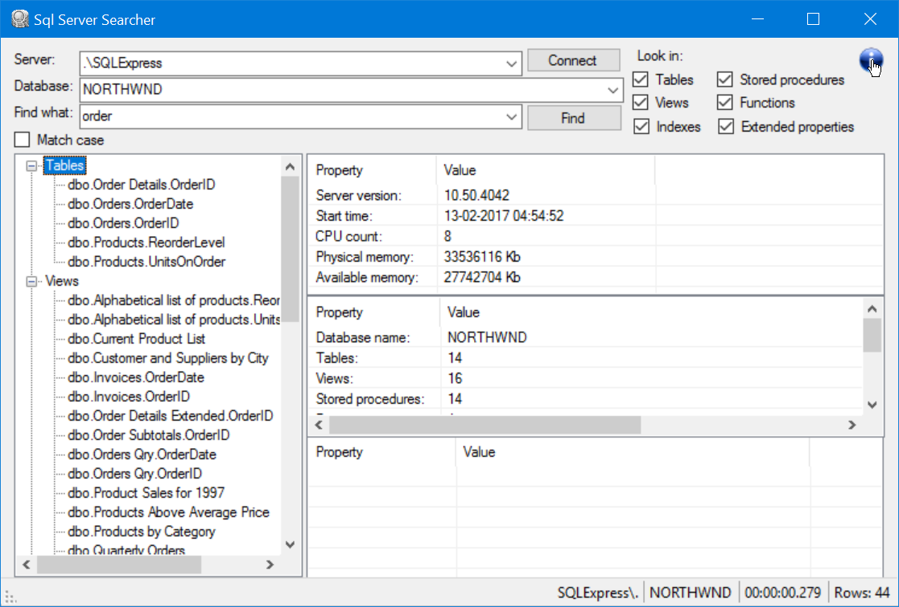

SqlServerSearcher
====

I made this application to make it easier to search a Microsoft SQL Server database. The application makes it possible to search in:

* Table names
* Table column names
* View names
* View column names
* Index names
* Stored procedure names
* Stored procedure definitions
* Stored procedure parameter names
* Function names
* Function definitions
* Function parameter names

The application searches the specified database system views for the information.

When right-clicking a found stored procedure name og function name in the treeview, its possible to get the definition shown.

Shortcut keys
----

* Alt-C: Connect
* F3 or Alt-F: Find
* F12: Show definition of stored procedure og function

Task list
----

- [ ] Make it possible to use more than one search term
- [ ] Implement the 'Match case' checkbox functionality
- [x] Display metadata about the found element when clicking the TreeView node
- [x] Display metadata about the connected server
- [ ] Right-click in treeview to find all references
- [x] Right-click in treeview to show content of stored procedure or function
- [x] Highlight the matches found in the definition of stored procedures and functions
- [ ] Implement Find in the view definition dialog

Screenshots
----

The login dialog

Search

View definition

Binaries
----

A zipfile with the latest build can be here: [https://github.com/CoderAllan/SqlServerSearcher/tree/master/binaries]([https://github.com/CoderAllan/SqlServerSearcher/tree/master/binaries])

To install the tool, just unzip the file and doubleclick the SQLServerSearcher.exe file.

Icons
----

Icons for the application is from: [https://github.com/ioBroker/ioBroker.icons-open-icon-library-png]([https://github.com/ioBroker/ioBroker.icons-open-icon-library-png])

Packages used
----

* [ScintillaNET](https://github.com/jacobslusser/ScintillaNET)
